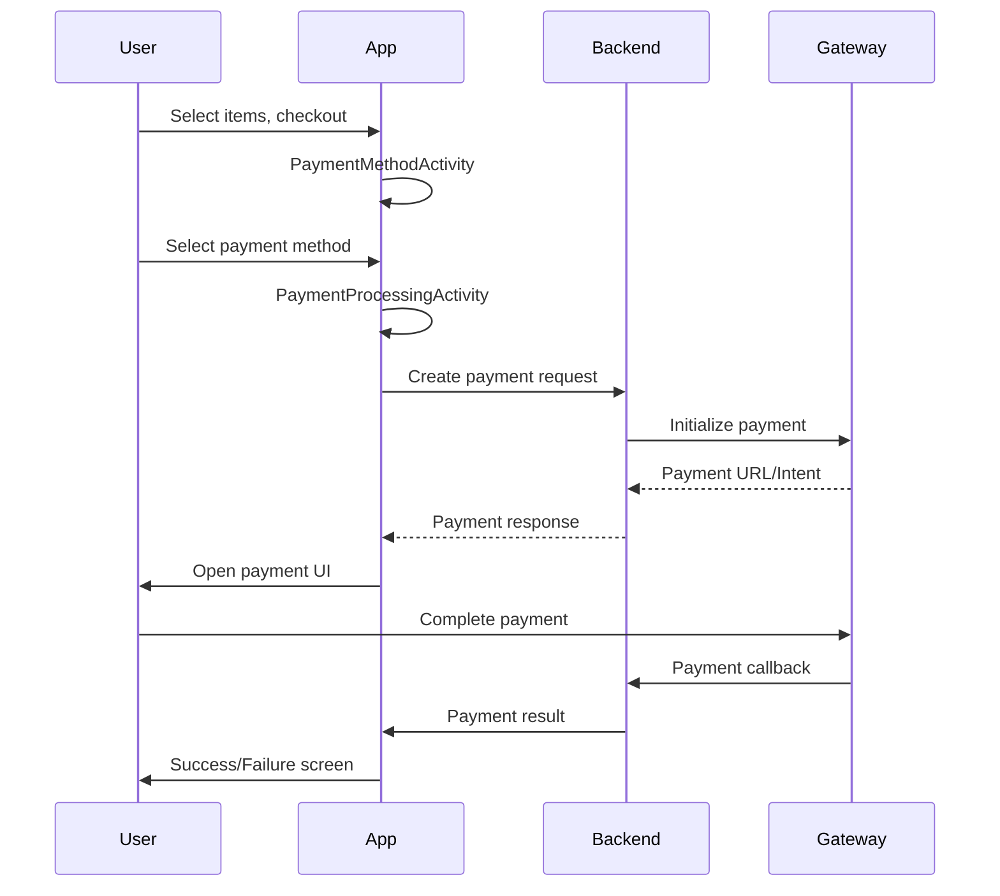

# Payment Integration Guide - VNPay & Stripe

## Table of Contents
1. [Overview](#overview)
2. [Architecture](#architecture)
3. [VNPay Integration](#vnpay-integration)
4. [Stripe Integration](#stripe-integration)
5. [Payment Flow](#payment-flow)
6. [Success & Failure Screens](#success--failure-screens)
7. [Payment Processing Animations](#payment-processing-animations)
8. [Configuration](#configuration)
9. [Backend Setup](#backend-setup)
10. [Testing](#testing)
11. [Security Considerations](#security-considerations)

## Overview

The Mini E-commerce Android app integrates two major payment gateways:
- **VNPay**: Vietnam's leading payment platform supporting local banks, cards, and QR payments
- **Stripe**: International payment processor supporting credit cards, digital wallets

### Key Features
- **Modular Architecture**: Easy to add new payment methods
- **Unified Interface**: Consistent payment experience across all methods
- **Animated UI**: Smooth loading animations and status feedback
- **Error Handling**: Comprehensive error management and retry mechanisms
- **Deep Link Support**: Seamless return to app after external payment
- **Order Management**: Automatic cart clearing and order history tracking

## Architecture

```
┌─────────────────────────────────────────────────────────────┐
│                    Android App Layer                        │
├─────────────────────────────────────────────────────────────┤
│  PaymentMethodActivity → PaymentProcessingActivity          │
│            ↓                        ↓                       │
│    PaymentManager → PaymentProcessor Interface              │
│         ├── VNPayProcessor                                  │
│         └── StripeProcessor                                 │
├─────────────────────────────────────────────────────────────┤
│                   Backend APIs                              │
├─────────────────────────────────────────────────────────────┤
│  VNPay Backend API        │        Stripe Server           │
│  (ASP.NET Core)          │        (Node.js/Express)       │
├─────────────────────────────────────────────────────────────┤
│                External Payment Gateways                   │
│      VNPay Gateway              Stripe API                 │
└─────────────────────────────────────────────────────────────┘
```

### Core Components

```
payment/
├── PaymentProcessor.java          # Interface for all payment methods
├── PaymentRequest.java           # Base payment request model
├── PaymentResult.java            # Payment result model
├── PaymentManager.java           # Central payment coordinator
├── vnpay/
│   ├── VNPayProcessor.java       # VNPay implementation
│   ├── VNPayRequest.java         # VNPay-specific request
│   └── VNPayResponse.java        # VNPay API response
└── stripe/
    ├── StripeProcessor.java      # Stripe implementation
    └── StripeRequest.java        # Stripe-specific request
```

## VNPay Integration

### Implementation Details

VNPay integration follows a web-based approach using WebView for secure payment processing.

#### 1. VNPayProcessor.java
```java
public class VNPayProcessor implements PaymentProcessor {
    @Override
    public void processPayment(Context context, PaymentRequest request, PaymentCallback callback) {
        // 1. Create VNPay request
        VNPayRequest vnpayRequest = (VNPayRequest) request;
        
        // 2. Call backend API to generate payment URL
        Call<VNPayResponse> call = RetrofitClient.getInstance()
                .getApiService()
                .createVNPayPayment(vnpayRequest);
                
        // 3. Handle response and open WebView
        call.enqueue(new Callback<VNPayResponse>() {
            @Override
            public void onResponse(Call<VNPayResponse> call, Response<VNPayResponse> response) {
                if (response.isSuccessful() && response.body().getPaymentUrl() != null) {
                    // Open PaymentWebViewActivity with payment URL
                    Intent intent = new Intent(context, PaymentWebViewActivity.class);
                    intent.putExtra("payment_url", response.body().getPaymentUrl());
                    context.startActivity(intent);
                }
            }
        });
    }
}
```

#### 2. Payment Flow
1. **Request Creation**: `VNPayRequest` with order details, amount, currency (VND)
2. **Backend API Call**: POST to `/api/Payment/vnpay/create`
3. **WebView Launch**: Opens `PaymentWebViewActivity` with VNPay URL
4. **User Payment**: User completes payment on VNPay website
5. **Callback Handling**: VNPay redirects to callback URL
6. **Result Processing**: App processes result via URL monitoring and JavaScript injection

#### 3. Supported Payment Methods
- Vietnamese banks (ATM cards, Internet Banking)
- International cards (Visa, MasterCard, JCB)
- VNPay QR code
- Mobile banking apps

#### 4. Response Codes
| Code | Status | Description |
|------|--------|-------------|
| 00 | SUCCESS | Payment successful |
| 07 | PENDING | Transaction deducted, awaiting confirmation |
| 10 | FAILED | Payment failed |
| 11 | FAILED | Payment timeout |
| 24 | CANCELLED | User cancelled |
| 51 | FAILED | Insufficient balance |

## Stripe Integration

### Implementation Details

Stripe integration uses the native Android SDK with PaymentSheet for optimal user experience.

#### 1. StripeProcessor.java
```java
public class StripeProcessor implements PaymentProcessor {
    private static final String STRIPE_PUBLISHABLE_KEY = "pk_test_...";
    private static final String BACKEND_URL = "http://10.0.2.2:4242/create-payment-intent";
    
    @Override
    public void processPayment(Context context, PaymentRequest request, PaymentCallback callback) {
        // 1. Initialize Stripe
        PaymentConfiguration.init(context, STRIPE_PUBLISHABLE_KEY);
        
        // 2. Create PaymentSheet
        paymentSheet = new PaymentSheet((FragmentActivity) context, this::onPaymentSheetResult);
        
        // 3. Fetch client secret from backend
        fetchClientSecretAndPay(request);
    }
    
    private void fetchClientSecretAndPay(PaymentRequest request) {
        // Call backend to create payment intent
        // Present PaymentSheet with client secret
    }
}
```

#### 2. Payment Flow
1. **Request Creation**: `StripeRequest` with amount in cents, currency (USD)
2. **Backend Call**: POST to Node.js server to create PaymentIntent
3. **PaymentSheet**: Native Stripe UI opens for card input
4. **Payment Processing**: Stripe handles payment securely
5. **Result Callback**: Immediate result via PaymentSheet callback

#### 3. Supported Payment Methods
- Credit/Debit Cards (Visa, MasterCard, American Express)
- Apple Pay (iOS)
- Google Pay (Android)
- Digital wallets

## Payment Flow

### Complete User Journey



### Step-by-Step Process

#### 1. Checkout Initiation
```java
// CartActivity → CheckoutActivity
Intent intent = new Intent(this, CheckoutActivity.class);
intent.putExtra("total_amount", CartManager.getInstance().getTotalAmount());
startActivity(intent);
```

#### 2. Payment Method Selection
```java
// PaymentMethodActivity
PaymentManager paymentManager = PaymentManager.getInstance();
List<PaymentProcessor.PaymentMethod> methods = paymentManager.getAvailablePaymentMethods();
// Display: VNPay, Stripe options
```

#### 3. Payment Processing
```java
// PaymentProcessingActivity
PaymentManager.getInstance().processPayment(
    selectedMethod,
    context,
    paymentRequest,
    paymentCallback
);
```

#### 4. External Payment (VNPay)
```java
// PaymentWebViewActivity
webView.loadUrl(vnpayPaymentUrl);
// Monitor for callback URLs
// Inject JavaScript for result detection
```

#### 5. Native Payment (Stripe)
```java
// StripeProcessor
paymentSheet.presentWithPaymentIntent(clientSecret, configuration);
```

## Success & Failure Screens

### Success Screen Implementation

#### PaymentSuccessActivity.java
```java
public class PaymentSuccessActivity extends AppCompatActivity {
    @Override
    protected void onCreate(Bundle savedInstanceState) {
        super.onCreate(savedInstanceState);
        setContentView(R.layout.activity_payment_success);
        
        // Display payment information
        displayPaymentInfo();
        
        // Setup navigation buttons
        setupClickListeners();
    }
    
    private void displayPaymentInfo() {
        String transactionId = getIntent().getStringExtra("transaction_id");
        String orderId = getIntent().getStringExtra("order_id");
        double amount = getIntent().getDoubleExtra("amount", 0.0);
        
        transactionIdText.setText("Transaction ID: " + transactionId);
        orderIdText.setText("Order ID: " + orderId);
        amountText.setText(String.format("Amount Paid: $%.2f", amount));
    }
}
```

#### Layout Features
- **Green checkmark icon**: Visual success indicator
- **Transaction details**: ID, order ID, amount
- **Action buttons**: Continue Shopping, View Orders
- **Card design**: Elevated card with rounded corners

#### UI Elements
```xml
<ImageView
    android:layout_width="100dp"
    android:layout_height="100dp"
    android:src="@drawable/ic_check_circle"
    android:tint="@color/success" />

<TextView
    android:text="Payment Successful!"
    android:textColor="@color/success"
    android:textSize="24sp"
    android:textStyle="bold" />
```

### Failure Screen Implementation

#### FailureActivity.java
```java
public class FailureActivity extends AppCompatActivity {
    private static final int REDIRECT_DELAY = 3000; // 3 seconds
    
    @Override
    protected void onCreate(Bundle savedInstanceState) {
        super.onCreate(savedInstanceState);
        setContentView(R.layout.failure_popup);
        
        // Auto redirect after delay
        new Handler(Looper.getMainLooper()).postDelayed(() -> {
            redirectToCheckout();
        }, REDIRECT_DELAY);
    }
    
    private void redirectToCheckout() {
        Intent intent = new Intent(this, CheckoutActivity.class);
        intent.setFlags(Intent.FLAG_ACTIVITY_CLEAR_TOP | Intent.FLAG_ACTIVITY_NEW_TASK);
        intent.putExtra("payment_failed", true);
        startActivity(intent);
        finish();
    }
}
```

#### Layout Features
- **Red X icon**: Visual error indicator
- **Error message**: Clear failure reason
- **Auto-redirect**: Returns to checkout after 3 seconds
- **Manual tap**: User can tap to redirect immediately

#### UI Elements
```xml
<ImageView
    android:layout_width="80dp"
    android:layout_height="80dp"
    android:background="@drawable/circle_error_background"
    android:tint="#D32F2F" />

<TextView
    android:text="Payment Failed"
    android:textColor="#D32F2F"
    android:textSize="24sp"
    android:textStyle="bold" />
```

## Payment Processing Animations

### Loading Animation Implementation

#### PaymentProcessingActivity.java
```java
private void showLoading() {
    progressBar.setVisibility(ProgressBar.VISIBLE);
    statusText.setText("Processing payment...");
    retryButton.setVisibility(Button.GONE);
    
    // Optional: Add rotation animation
    Animation rotation = AnimationUtils.loadAnimation(this, R.anim.rotate);
    progressBar.startAnimation(rotation);
}

private void hideLoading() {
    progressBar.setVisibility(ProgressBar.GONE);
    progressBar.clearAnimation();
}
```

### Animation Types

#### 1. Progress Bar Animation
```xml
<!-- progress_bar_drawable.xml -->
<layer-list xmlns:android="http://schemas.android.com/apk/res/android">
    <item android:id="@android:id/background">
        <shape>
            <solid android:color="#E0E0E0" />
        </shape>
    </item>
    <item android:id="@android:id/progress">
        <clip>
            <shape>
                <solid android:color="@color/primary_purple" />
            </shape>
        </clip>
    </item>
</layer-list>
```

#### 2. WebView Loading Progress
```java
// PaymentWebViewActivity
webView.setWebChromeClient(new WebChromeClient() {
    @Override
    public void onProgressChanged(WebView view, int newProgress) {
        progressBar.setProgress(newProgress);
        if (newProgress == 100) {
            progressBar.setVisibility(View.GONE);
        }
    }
});
```

#### 3. Success/Failure Popup Animations
```java
// Auto-redirect with fade animation
overridePendingTransition(android.R.anim.fade_in, android.R.anim.fade_out);
```

### UI States

#### Processing State
- **Progress indicator**: Spinning/pulsing animation
- **Status text**: "Processing payment..."
- **Payment icon**: Animated payment card icon
- **Disabled retry**: Button hidden during processing

#### Success State
- **Checkmark animation**: Scale-in animation
- **Green theme**: Success color scheme
- **Celebration effect**: Optional confetti animation
- **Auto-navigation**: Delayed redirect to success page

#### Failure State
- **Error icon animation**: Shake animation
- **Red theme**: Error color scheme
- **Retry option**: Prominent retry button
- **Error details**: Clear error message

## Configuration

### Android App Configuration

#### 1. API Configuration (ApiConfig.java)
```java
public class ApiConfig {
    // Backend API base URL
    public static final String BASE_URL = "http://10.0.2.2:5096/api/";
    
    // VNPay return URL
    public static final String VNPAY_RETURN_URL = 
        "http://10.0.2.2:5096/api/payment/vnpay/callback";
    
    // Stripe configuration
    public static final String STRIPE_PUBLISHABLE_KEY = 
        "pk_test_51RZQtlRpw5sw2xnalWMscpCULRzSPboYAjpXy2HMl1sO7T5z8kKALrlNX3hxkKsdlShdu53MnWcMujVO3zOlnmH9009frbtXBh";
}
```

#### 2. Deep Link Configuration (AndroidManifest.xml)
```xml
<activity
    android:name=".PaymentProcessingActivity"
    android:launchMode="singleTop">
    <intent-filter>
        <action android:name="android.intent.action.VIEW" />
        <category android:name="android.intent.category.DEFAULT" />
        <category android:name="android.intent.category.BROWSABLE" />
        <data android:scheme="vnpay" android:host="return" />
    </intent-filter>
</activity>
```

#### 3. Dependencies (build.gradle.kts)
```kotlin
dependencies {
    // Stripe
    implementation("com.stripe:stripe-android:20.25.0")
    
    // Network
    implementation("com.squareup.retrofit2:retrofit:2.9.0")
    implementation("com.squareup.retrofit2:converter-gson:2.9.0")
    implementation("com.squareup.okhttp3:okhttp:4.12.0")
    
    // UI
    implementation("androidx.cardview:cardview:1.0.0")
    implementation("com.google.android.material:material:1.11.0")
}
```

## Backend Setup

### VNPay Backend (ASP.NET Core)

#### API Endpoints
```csharp
[HttpPost("vnpay/create")]
public async Task<IActionResult> CreateVNPayPayment([FromBody] VNPayRequest request)
{
    // Generate VNPay payment URL
    var paymentUrl = _vnpayService.CreatePaymentUrl(request);
    
    return Ok(new VNPayResponse
    {
        Success = true,
        PaymentUrl = paymentUrl,
        OrderId = request.OrderId,
        TransactionId = Guid.NewGuid().ToString()
    });
}

[HttpGet("vnpay/callback")]
public async Task<IActionResult> VNPayCallback()
{
    // Validate VNPay signature
    // Process payment result
    // Redirect to app with result
}
```

### Stripe Backend (Node.js)

#### Server Setup (server.js)
```javascript
const express = require('express');
const stripe = require('stripe')('sk_test_...');
const app = express();

app.use(express.json());

// Create payment intent
app.post('/create-payment-intent', async (req, res) => {
    const { amount, currency, orderId, description } = req.body;
    
    const paymentIntent = await stripe.paymentIntents.create({
        amount: Math.round(amount),
        currency: currency.toLowerCase(),
        automatic_payment_methods: { enabled: true },
        metadata: { orderId, description }
    });
    
    res.json({
        clientSecret: paymentIntent.client_secret,
        paymentIntentId: paymentIntent.id
    });
});

app.listen(4242, () => {
    console.log('🚀 Stripe server running on port 4242');
});
```

#### Package.json
```json
{
  "name": "mini-ecom-stripe-server",
  "version": "1.0.0",
  "dependencies": {
    "express": "^4.19.2",
    "stripe": "^14.25.0"
  },
  "scripts": {
    "start": "node server.js",
    "dev": "nodemon server.js"
  }
}
```

## Testing

### VNPay Testing

#### Test Environment
- **Sandbox URL**: `https://sandbox.vnpayment.vn/`
- **Test Credentials**: Provided by VNPay merchant account

#### Test Cards
```
Bank: NCB
Card Number: 9704198526191432198
Card Name: NGUYEN VAN A
Issue Date: 07/15
OTP: 123456
```

### Stripe Testing

#### Test Cards
```
Success: 4242424242424242 (Visa)
Success: 5555555555554444 (Mastercard)
Decline: 4000000000000002 (Generic decline)
Insufficient funds: 4000000000009995
```

#### Backend Testing
```bash
# Start Stripe server
cd server
npm install
npm start

# Test health endpoint
curl http://localhost:4242/health

# Test payment intent creation
curl -X POST http://localhost:4242/create-payment-intent \
  -H "Content-Type: application/json" \
  -d '{"amount": 100, "currency": "usd"}'
```

### Integration Testing

#### Test Scenarios
1. **Successful VNPay Payment**
   - Select VNPay → Enter test card → Complete payment → Verify success screen
   
2. **Failed VNPay Payment**
   - Select VNPay → Cancel payment → Verify failure screen → Retry functionality
   
3. **Successful Stripe Payment**
   - Select Stripe → Enter test card → Complete payment → Verify success screen
   
4. **Network Error Handling**
   - Disable network → Attempt payment → Verify error handling → Retry with network

## Security Considerations

### Data Protection
- **No sensitive data storage**: Payment credentials never stored in app
- **HTTPS communication**: All API calls use secure connections
- **Token-based authentication**: Secure API access
- **Input validation**: All payment data validated before processing

### VNPay Security
- **Signature validation**: All callbacks verified with secure hash
- **IP whitelisting**: Backend restricts callback sources
- **Amount verification**: Payment amounts validated server-side
- **Timeout handling**: Payment sessions have time limits

### Stripe Security
- **PCI compliance**: Stripe handles all sensitive card data
- **Client secret**: One-time use tokens for payment intents
- **Webhook validation**: Payment confirmations verified
- **3D Secure**: Automatic fraud protection

### App Security
- **Deep link validation**: All callback data validated
- **SSL pinning**: Prevent man-in-the-middle attacks
- **Obfuscation**: Payment logic protected in release builds
- **Error handling**: No sensitive information in error messages

---

## Summary

This integration provides a robust, secure, and user-friendly payment experience with:

- **Dual Gateway Support**: VNPay for Vietnamese users, Stripe for international
- **Modular Architecture**: Easy to extend with additional payment methods
- **Rich UI/UX**: Animated loading states, clear success/failure feedback
- **Comprehensive Error Handling**: Graceful failure recovery with retry options
- **Security First**: Industry-standard security practices throughout
- **Testing Ready**: Complete test environment setup for both gateways

The implementation follows Android best practices with proper separation of concerns, making it maintainable and scalable for future enhancements. 